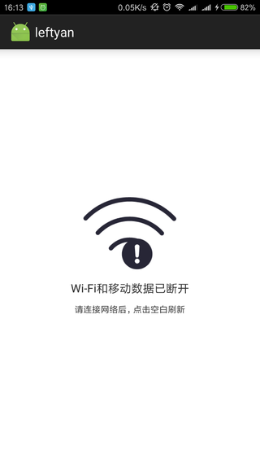
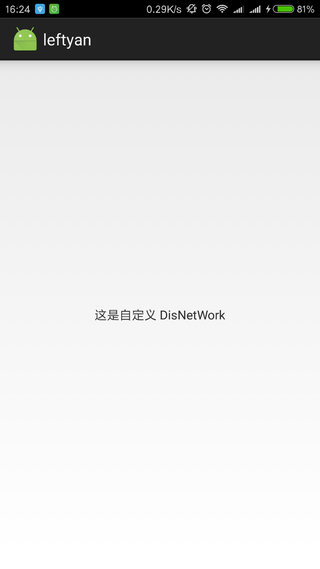

[  ](https://bintray.com/left/maven/multiple-lib/_latestVersion)
<a href='https://bintray.com/leftyan/maven/multiple-lib?source=watch' alt='Get automatic notifications about new "multiple-lib" versions'></a>
# MultipleStatusView

### 使用 ###
gradle 使用
```
compile 'com.ling.leftyan:multiple-lib:0.0.1'
```

```
<com.mvc.multiple.MultipleStatusView
        android:id="@+id/multiple"
        android:layout_width="match_parent"
        android:layout_height="match_parent">

        //要显示内容的布局
</com.mvc.multiple.MultipleStatusView>
```

默认情况下，显示内容界面。可以在初始化时，显示加载界面。
```
    mMultipleStatusView = (MultipleStatusView) findViewById(R.id.multiple);
    //数据请求开始
    mMultipleStatusView.showLoading();//显示加载界面

    //数据请求结束

    //根据需求，显示不同的界面
    mMultipleStatusView.showContent();//显示内容界面
    mMultipleStatusView.showDisNetwork();//显示无网络界面
    mMultipleStatusView.showError();//显示加载错界面
    mMultipleStatusView.showEmpty();//显示空数据界面
```

### 自定义界面 ###
multiple-lib 库中，已经包含了4个基本的界面。

默认无网络界面：



用户可以通过设置，显示自定义界面
```
<LinearLayout xmlns:android="http://schemas.android.com/apk/res/android"
    android:layout_width="match_parent"
    android:layout_height="match_parent"
    android:gravity="center"
    android:orientation="vertical">

    <TextView
        android:id="@+id/custom_disnetwork_txt"
        android:layout_width="wrap_content"
        android:layout_height="wrap_content"
        android:text="这是自定义 DisNetWork" />
</LinearLayout>
```

> app:dis_network_view="@layout/custom_disnetwork" //设置自定义无网络界面


```
<com.mvc.multiple.MultipleStatusView
        android:id="@+id/multiple"
        android:layout_width="match_parent"
        app:dis_network_view="@layout/custom_disnetwork"
        android:layout_height="match_parent">

        //显示内容
    </com.mvc.multiple.MultipleStatusView>
```

自定义无网络界面：



### 界面点击事件处理 ###
上面已经自定义过了DisNetwork布局，直接使用。
```
        View disNetWorkView = mMultipleStatusView.getDisNotWork();//获取你要处理的界面视图
        if (disNetWorkView != null) {
            TextView customText = (TextView) disNetWorkView.findViewById(R.id.custom_disnetwork_txt);
            customText.setOnClickListener(new View.OnClickListener() {
                @Override
                public void onClick(View v) {
                    Toast.makeText(MainActivity.this, "自定义DisNetwork 控件点击了", Toast.LENGTH_SHORT).show();
                }
            });

            disNetWorkView.setOnClickListener(new View.OnClickListener() {
                @Override
                public void onClick(View v) {
                    Toast.makeText(MainActivity.this, "自定义DisNetwork 界面点击了", Toast.LENGTH_SHORT).show();
                }
            });
        }
```

### 声明 ###
    Copyright 2016 LeftCoding

    Licensed under the Apache License, Version 2.0 （the "License"）;
    you may not use this file except in compliance with the License.
    You may obtain a copy of the License at

     http://www.apache.org/licenses/LICENSE-2.0

    Unless required by applicable law or agreed to in writing, software
    distributed under the License is distributed on an "AS IS" BASIS,
    WITHOUT WARRANTIES OR CONDITIONS OF ANY KIND, either express or implied.
    See the License for the specific language governing permissions and
    limitations under the License.